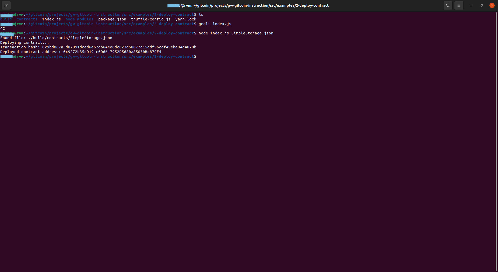

# Task 2

## 1. A screenshot of the console output immediately after you have successfully deployed a smart contract.



## 2. The transaction hash from the contract deployment (in text format).

```0x9bd067a3d87091dced6e67db64ee0dc023d58077c15ddf96cdf49ebe94d4870b```


## 3. The deployed contract address from the contract deployment (in text format).

```0x9272b35cD191c0D6617952D5680a85030Bc87CE4```

