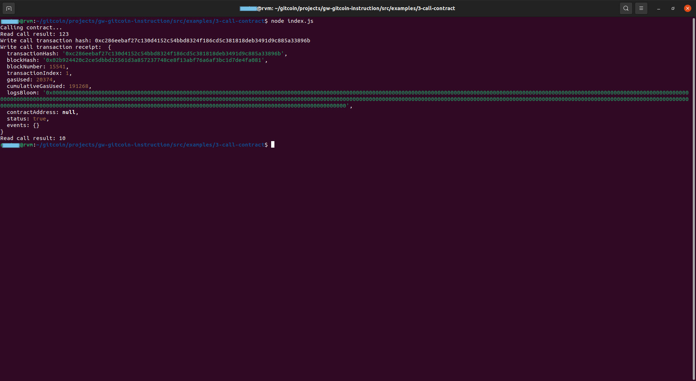

# Task 3

## A screenshot of the console output immediately after you have successfully issued a smart contract call.



## 2. The transaction hash from the console output (in text format).

```0xc286eebaf27c130d4152c54bbd8324f186cd5c381818deb3491d9c885a33896b```


## 3. The contract address that you called (in text format).

```0x9272b35cD191c0D6617952D5680a85030Bc87CE4```

## 4.The ABI for contract you made a call on (in text format).
```
"abi": [
    {
      "inputs": [],
      "stateMutability": "payable",
      "type": "constructor"
    },
    {
      "inputs": [
        {
          "internalType": "uint256",
          "name": "x",
          "type": "uint256"
        }
      ],
      "name": "set",
      "outputs": [],
      "stateMutability": "payable",
      "type": "function"
    },
    {
      "inputs": [],
      "name": "get",
      "outputs": [
        {
          "internalType": "uint256",
          "name": "",
          "type": "uint256"
        }
      ],
      "stateMutability": "view",
      "type": "function"
    }
  ]
  
 ```


