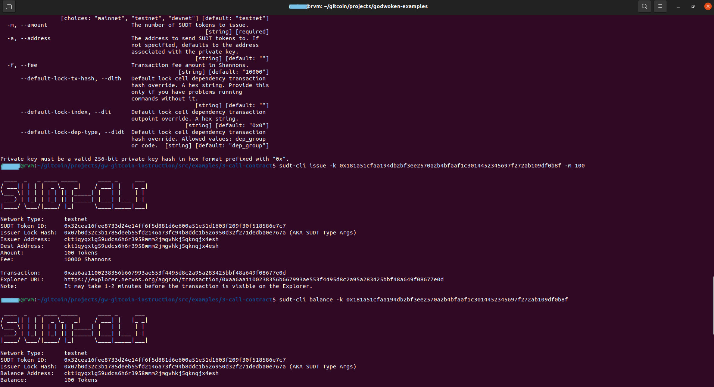
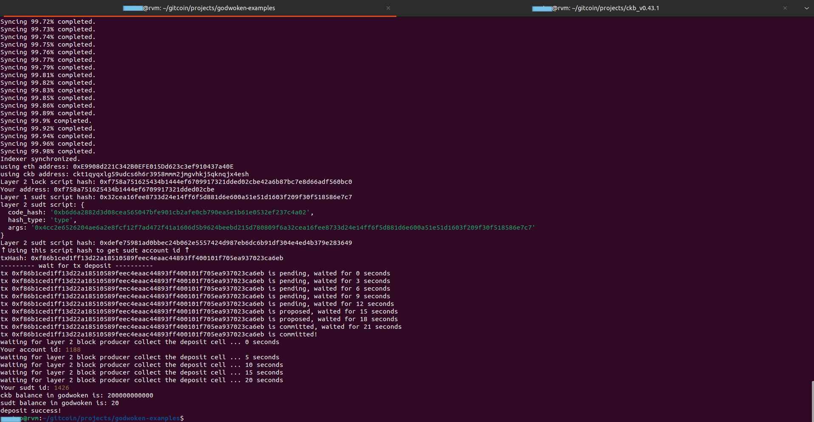

# Task 4

## 1. A link to the Layer 1 address you funded on the Testnet Explorer.

https://explorer.nervos.org/aggron/address/ckt1qyqxlg59udcs6h6r3958mmm2jmgvhkj5qknqjx4esh

## 2. A screenshot of the console output immediately after using sudt-cli to create your SUDT tokens on Layer 1.




## 3. A link to the transaction ID created by sudt-cli on the Testnet Explorer.

https://explorer.nervos.org/aggron/transaction/0xaa6aa1100238356b667993ae553f4495d8c2a95a283425bbf48a649f08677e0d

## 4. A screenshot of the console output immediately after you have successfully submitted a deposit to Layer 2 using the account-cli tool.



## 5. The SUDT ID from the console output after executing the deposit script (in text format).

```Your sudt id: 1426```


