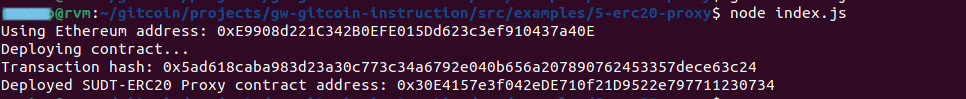
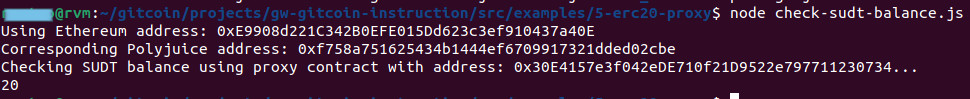

# Task 5

## A screenshot of the console output immediately after deploying smart contract.



## 2. The address of the ERC20 Proxy Contract you deployed (in text format).

```0x30E4157e3f042eDE710f21D9522e797711230734```


## 3. A screenshot of the console output immediately after checking your SUDT balance.



## 4.The Ethereum address that was checked (in text format).
```0xE9908d221C342B0EFE015Dd623c3ef910437a40E```


