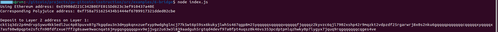

# Task 6

## A screenshot of the console output immediately after you have successfully generated your Deposit Receiver Address.



## 2. Your Deposit Receiver Address (in text format).

```ckt1q3dz2p4mdrvp5ywu4kk5edl2uc4p03puvx07g7kgqdau3n3dmypkqnxzuefxyp9wdghglncj77k5wt6p59sx6kukyjlwh5s467qgp8m25yqqqqqsqqqqqvqqqqqfjqqqqz2kyvzc6qjl7902xshp42r9mqzkt2vdpzdf25rgarwrj8x0s2nku6gqqqqpqqqqqqcqqqqqxyqqqqx7asf60w8pqpte2sfcfn90fdfzxue7ff2g8sawe9wacnqat6jmygqngqqqqpxv9ejjvgz2u63w3l839aadguh5rgtqd4devf97a0fpt4uqsz0k46vs353pcdptpmlqzhwky0p7lygyx7jquq9rqgqqqqqqcqges4ve```


## 3. The Ethereum address used to generate the Deposit Receiver Address (in text format).

```0xE9908d221C342B0EFE015Dd623c3ef910437a40E```

## 4. A link to the Etherscan explorer for the successful Force Bridge transaction. 

https://rinkeby.etherscan.io/tx/0x068f9548a90019e40e11c464193bbc1ec3fa064a18d86bcf05da6345fcf99dc4

## 5. A link to the Nervos explorer for the successful Force bridge transaction. 

https://explorer.nervos.org/aggron/transaction/0x6a61475a7e6b88e525a0642a5a979df44b86b4482b4b83665dab649d0bf129e6

